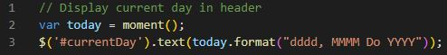
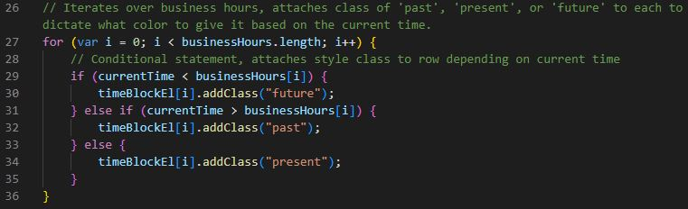
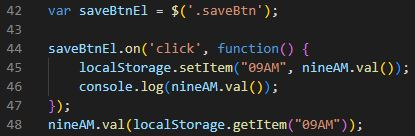

# Work-Day-Scheduler
This program creates a calendar application that allows users to save events throughout the day.

## Description
This projest is a program that creates a simple calendar application for work day scheduling. The application displays the current day and allows the user to input text in fields for every hour of the work day. The text is saved to the browser by clicking the save icon to the right of each text block. Additionally, the current time is tracked by color coding of the text fields: green indicates future, red is present, and grey is past.

### Deployed Application
[Work-Day-Scheduler](https://briceveyna.github.io/Work-Day-Scheduler/)

### Badges
   

## Usage
The current day display shown below was created using moment.js to retrieve the date and format it. It was then displayed using jQuery format to pull the correct Id and write to it.

Color assignment of the text fields was done using a for loop, iterating over the length of an array created for the listed business hours. A conditional statement was then executed with respect to the relationship between the current time, defined using moment.js, and the array of business hours at the index value. For each case, a class was assigned with an associated color value.

The save function was performed by using a click event on a button to trigger local storage of that associated text box. That information was then immediately retrieved from local storage and displayed so that it would persist on the page even once the page is reloaded.

## Technologies Used
- JavaScript
- HTML
- CSS
- moment.js

## Questions
If you have any additional questions, feel free to reach out.
- [Github](https://github.com/BriceVeyna)
- [LinkedIn](https://www.linkedin.com/in/brice-veyna/)
- Email: briceveyna@gmail.com

## License
Brice Veyna's Family Memories is licensed under the [MIT License](https://opensource.org/licenses/MIT).

Copyright 2022 Brice Veyna

Permission is hereby granted, free of charge, to any person obtaining a copy of this software and associated documentation files (the "Software"), to deal in the Software without restriction, including without limitation the rights to use, copy, modify, merge, publish, distribute, sublicense, and/or sell copies of the Software, and to permit persons to whom the Software is furnished to do so, subject to the following conditions:

The above copyright notice and this permission notice shall be included in all copies or substantial portions of the Software.

THE SOFTWARE IS PROVIDED "AS IS", WITHOUT WARRANTY OF ANY KIND, EXPRESS OR IMPLIED, INCLUDING BUT NOT LIMITED TO THE WARRANTIES OF MERCHANTABILITY, FITNESS FOR A PARTICULAR PURPOSE AND NONINFRINGEMENT. IN NO EVENT SHALL THE AUTHORS OR COPYRIGHT HOLDERS BE LIABLE FOR ANY CLAIM, DAMAGES OR OTHER LIABILITY, WHETHER IN AN ACTION OF CONTRACT, TORT OR OTHERWISE, ARISING FROM, OUT OF OR IN CONNECTION WITH THE SOFTWARE OR THE USE OR OTHER DEALINGS IN THE SOFTWARE.
